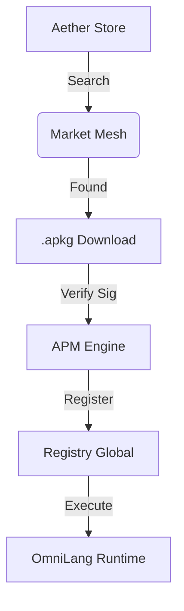

# Aether Store & APM Engine (v7.0)

**Arsitektur Distribusi Aplikasi Universal**

## 1. Konsep Dasar
Aether Store bukan sekadar toko aplikasi terpusat, melainkan portal ke arah **Decentralized Capability Mesh**. APM (Aether Package Manager) adalah mesin di dalam kernel yang menangani siklus hidup aplikasi.

## 2. Format Paket `.apkg`
Setiap aplikasi OmniLang atau biner native dibungkus dalam format `.apkg` yang berisi:
- **`manifest.json`**: Metadata aplikasi (nama, versi, kategori, dependensi).
- **`data.bin`**: Payload terkompresi (target biner atau script OmniLang).
- **`signature.sig`**: Tanda tangan digital PQC untuk verifikasi Zero-Trust.

## 3. Kategori Aplikasi
APM mendukung empat kategori utama:
- **UI**: Aplikasi berbasis GUI (misal: *Aether Finance*).
- **Game**: Game real-time berbasis ECS.
- **AI**: Agent pintar yang berinteraksi dengan Oracle Engine.
- **System**: Tools utilitas sistem tingkat rendah.

## 4. Alur Kerja Instalasi (The Lifecycle)

## 5. Deployment untuk Developer
Untuk mempublikasikan aplikasi:
1. Compile script menggunakan `omc --release`.
2. Gunakan `apm pack <folder>` untuk menghasilkan `.apkg`.
3. Jalankan `apm publish` untuk menyebarkannya ke Mesh Network.

---
"Aether Store: Bringing the World's Capabilities to Your Intent." 🚀
